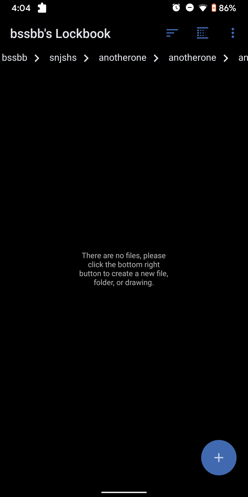
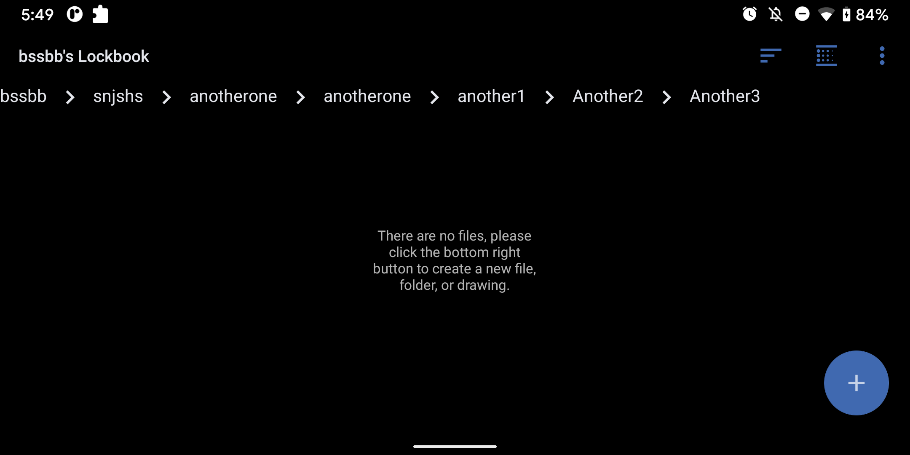

# android-breadcrumb

Basic and fully functional breadcrumb in android.

To add this library to your own project click *[here](https://jitpack.io/#SmailBarkouch/android-breadcrumb)*

Easy to use, simply add the breadcrumb to your layout xml file:

```
    <us.smailbarkouch.android_breadcrumb.BreadCrumbView
        android:id="@+id/breadcrumb_bar"
        android:layout_width="match_parent"
        android:layout_height="30dp"
        app:text_size="15"
        app:text_color="@android:color/holo_blue_bright"
        app:arrow_drawable="@drawable/ic_baseline_keyboard_arrow_right_24" />
```

You can populate the breadcrumb with breadcrumb items:

```
breadcrumb_bar.setBreadCrumbItems(path.map { BreadCrumb(it) }))
```

Add a listener if necessary:

```
breadcrumb_bar.setListener(object : BreadCrumbItemClickListener {
            override fun onItemClick(breadCrumbItem: View, position: Int) {
            // Do something
            }
        })
```

Available Functions:

```
    fun addBreadCrumbItem(item: BreadCrumb) 
    fun setListener(listener: BreadCrumbItemClickListener)
    fun setArrowDrawable(arrowDrawable: Int)
    fun setBreadCrumbItems(items: MutableList<BreadCrumb>) 
    fun setTextColor(textColor: Int)
    fun setTextSize(textSize: Int)
    fun getBreadCrumbItem(position: Int)
    fun removeAllBreadCrumbItems() 
    fun removeLastBreadCrumbItem() 

```

Screenshots:





